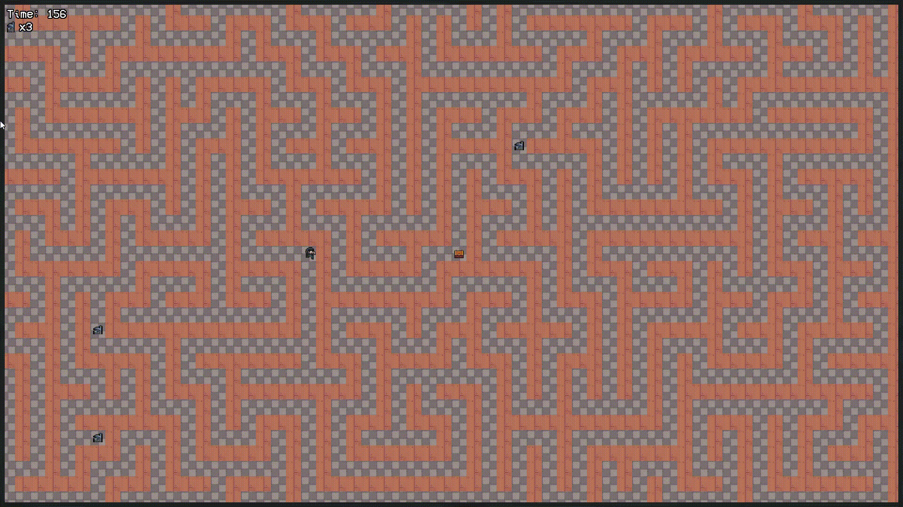
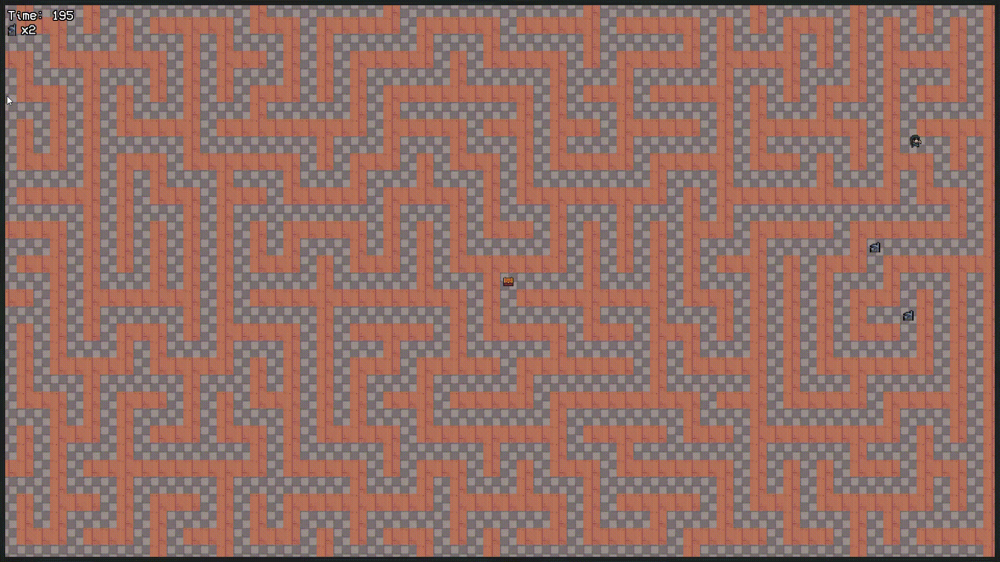
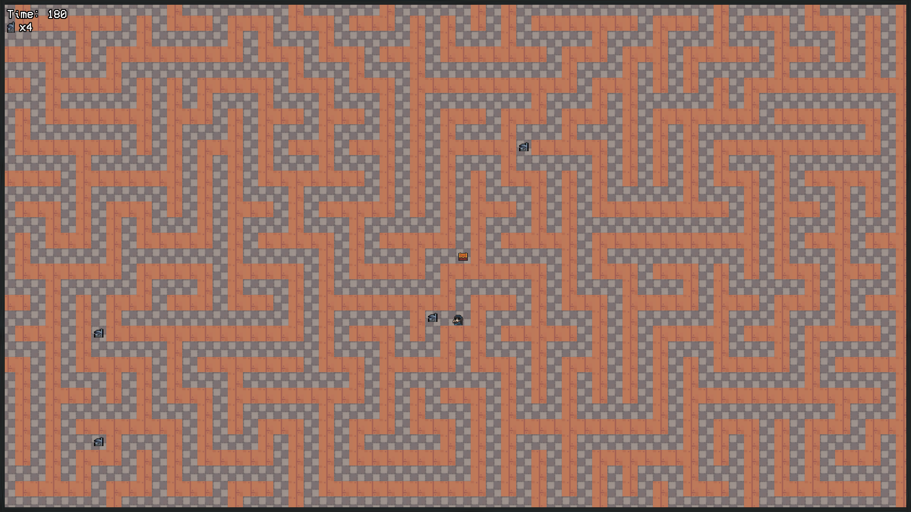
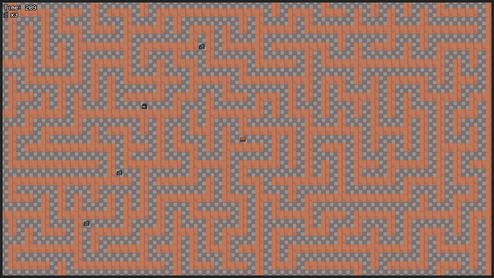
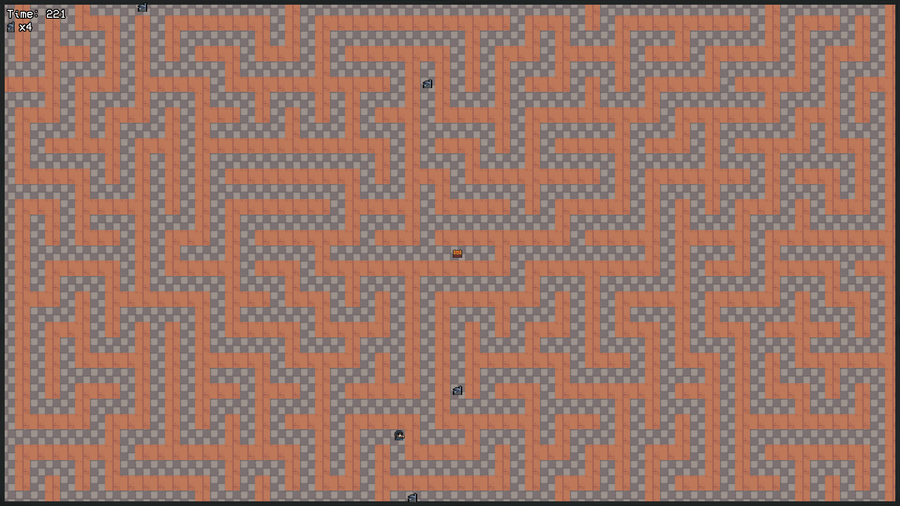

# Echoes of the Labyrinth (C++ / SFML)

My representation of a 2D top-down roguelike-inspired game, built in C++ with SFML for rendering.  
The player explores a constantly shifting labyrinth, where each restart reshuffles the map and changes the challenge.  
The goal: find 4 mystical keys and unlock the chest before time runs out! ⏳🗝️

---

# Project Features

- 🎮 **Controls** → WASD or Arrow Keys  
- 🧱 **Collision system** → Player interacts with walls and objects  
- 🔄 **Random Labyrinth Generation** → DFS Backtracking algorithm ensures a new layout each run  
- ⏳ **Timer system** → Fail if time reaches zero (labyrinth resets)  
- 🔑 **Collectibles** → 4 keys placed randomly in each run  
- 🟢 **Rendering** → Handled with SFML  
- 🧩 **OOP Game Patterns** → State, Singleton  
- 📁 **Clean folder structure**  
- 📑 **GitHub branch-based workflow**  
- 🧱 **Applied S.O.L.I.D principles**  
- 🧪 **Smart pointers, STL maps, vectors, RNG**  
- 📦 **Setup Installer** → Made with Inno Setup for easy distribution  
- 📊 **Kanban Project Management** → Using Notion board to track tasks and milestones  

---

## Gameplay 

## How to run the game (Windows) 
### 1st Option 
- Run game_setup.exe to install in your computer

### 2nd Option (without installing)
- Run SFML Echoes of the Labyrinth\x64\Release\SFML Echoes of the Labyrinth.exe

# Kanban Project Managment methology 📊🧐

- All tasks have been described and documented by applying a Kanban Project Managment methology in Notion to have structured worflow and clear steps inorder to complete the project 

## License
This project is licensed under the MIT License - see the [LICENSE](LICENSE) file for details.

## PROJECT NOTE:
    This is my first project using SFML and was implemented with the objective of practicing my game development skills and my C++ knowledge. Even though it worked out fine, I realize there is still much more to learn and improve.

